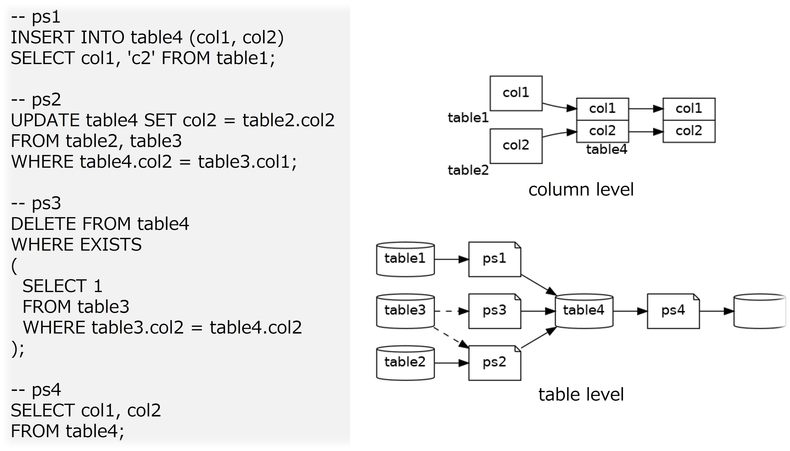

# pglineage

## Overview

pglineage is a tool to create data flow diagrams for PostgreSQL by analyzing SQL.

## Setup

To use pglineage, follow these steps:

1. Download:

    ~~~bash
    git clone https://github.com/gtk7032/pglineage.git
    ~~~  

1. Build the Docker image:

    ~~~bash
    docker compose build --build-arg UID="`id -u`" --build-arg GID="`id -g`"
    ~~~

    The UID and GID arguments will be assigned to the user used within the container.

1. Launch the container:

    ~~~bash
    docker compose up -d
    ~~~

## Example Usage

See the [sample program](src/pglineage/sample.py), which targets the SQL contained in all files within the resource folder.

Running the sample program with the following command generates the diagrams in the output folder.

~~~bash
docker exec -it pglineage python src/pglineage/sample.py
~~~

## Notice

Some grammars, such as UPSERT, are not supported at this time.

## License

[MIT](https://choosealicense.com/licenses/mit/)

## Author

[gtk7032](https://github.com/gtk7032)
